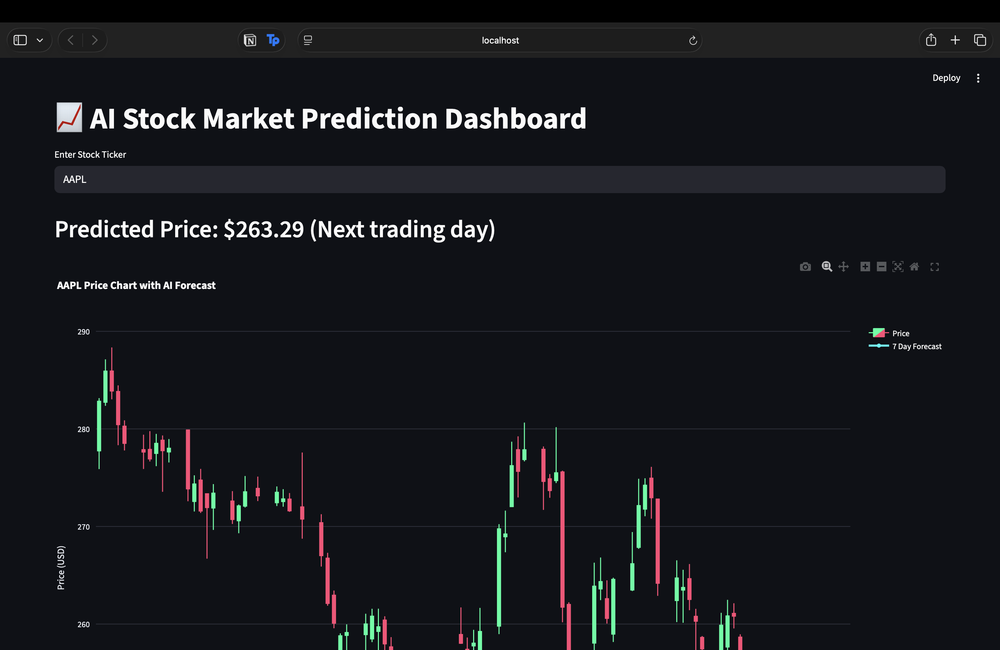
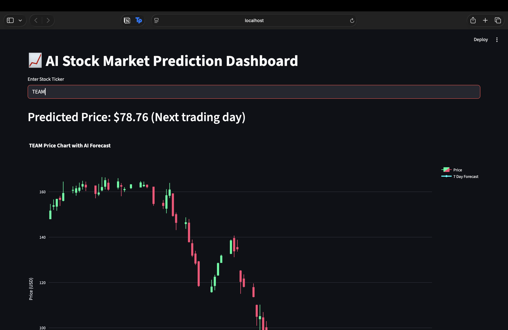
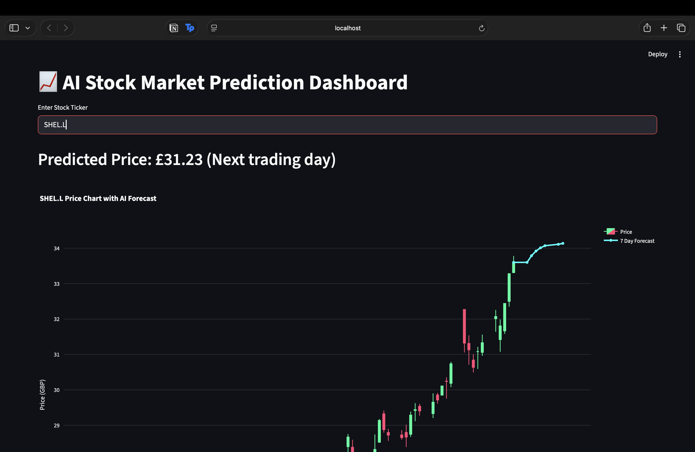
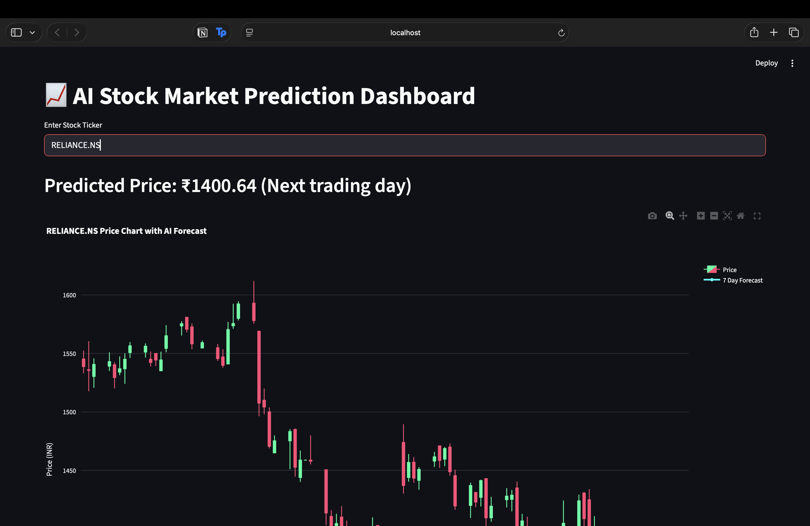

# AI Stock Market Prediction Dashboard

An AI-powered stock market analysis and forecasting system built with Python.

This project started as a financial data analysis pipeline and evolved into an **interactive AI-powered stock prediction dashboard**.

It demonstrates how raw financial data can be transformed into **predictive insights and visual analytics**.

---

# Key Features

✔ Automated stock data ingestion  
✔ Financial feature engineering  
✔ LSTM-based stock price prediction  
✔ 7-day price forecasting  
✔ Interactive candlestick charts  
✔ Multi-market support (US, UK, India, EU)  
✔ Automatic currency detection  
✔ GBX → GBP conversion for London stocks  
✔ Interactive dashboard built with Streamlit  

---

# Dashboard Preview

## Main Dashboard

---

## Example: Apple (NASDAQ)

---

## Example: Shell (London Stock Exchange)

---

## Example: Reliance Industries (NSE India)

---

# Project Goals

This project demonstrates:

✔ Building a **clean data pipeline**  
✔ Working with **real financial market data**  
✔ Implementing **machine learning forecasting models**  
✔ Creating **interactive financial dashboards**  
✔ Handling **multi-market stock exchanges and currencies**

In short:

> Turning raw stock data into **AI-driven financial insights**.

---

# What the System Does

## Data Collection

Stock data is downloaded automatically using **Yahoo Finance**.

Features retrieved:

- Open price
- High price
- Low price
- Close price
- Volume

Example supported markets:

| Market | Example Ticker |
|------|------|
| NASDAQ | AAPL |
| London Stock Exchange | SHEL.L |
| NSE India | RELIANCE.NS |
| XETRA Germany | SAP.DE |

---

# Machine Learning Model

The prediction model uses:

**LSTM (Long Short-Term Memory) Neural Networks**

Why LSTM?

- Designed for time-series data
- Captures long-term patterns in stock price movements
- Handles sequential dependencies in financial data

The model predicts:

- Next trading day price
- 7-day forecast

---

# Visualisation

The dashboard displays:

- Historical **candlestick price chart**
- **AI forecast line**
- Predicted next-day price
- Automatic currency conversion

Example visualisation:

Historical stock prices are displayed using candlestick charts, and the AI model generates a 7-day forecast extending from the most recent trading day.

---

# Multi-Currency Support

The system automatically detects the stock exchange currency.

Supported currencies:

| Exchange | Currency |
|------|------|
| NASDAQ | USD ($) |
| London Stock Exchange | GBP (£) |
| NSE India | INR (₹) |
| European markets | EUR (€) |

London stocks quoted in **GBX (pence)** are automatically converted to **GBP**.

Example conversion:
3367 GBX → £33.67

# Future Improvements

Possible extensions include:

Portfolio analysis
Multi-stock comparison
Backtesting strategies
Model accuracy evaluation
Cloud deployment
Real-time market data integration